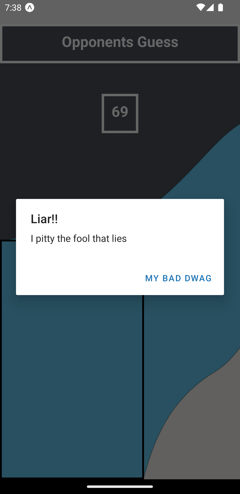

# Guesser_ReactNative
This is a React Native app- initialised with expo... 

You go up against the computer.

The computer tries to guess the number you provide, the computer has limited guesses, and you can only help it by 
hintng if its higher or lower than the previous guess. Let's see who wins

# Run the app 
You can run the app using "expo start"

